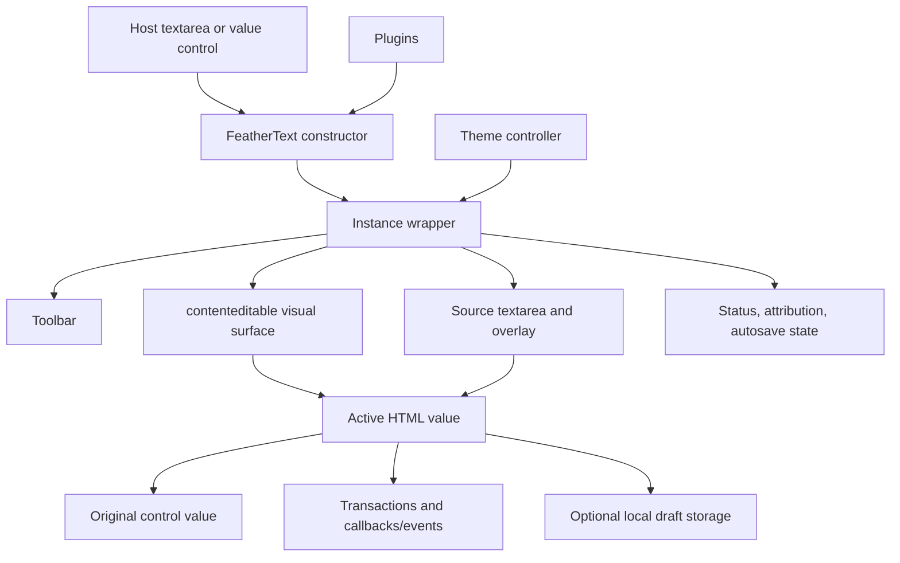

# Architecture

**A lightweight, free, framework-independent rich-text editor focused on speed, clarity, and practical customization.**

## Scope

FeatherText is a browser-side form-control enhancement built with direct DOM APIs and HTML strings. It does not require a UI framework or runtime dependency. It is not a schema-backed document model, virtual DOM, collaboration engine, sandbox, or server persistence layer.

## Module layout

| Path                        | Responsibility                                                                                 |
| --------------------------- | ---------------------------------------------------------------------------------------------- |
| `src/config.js`             | Immutable defaults, built-in themes, project/support constants, and config copying             |
| `src/icons.js`              | Inline current-color SVG markup                                                                |
| `src/security.js`           | URL normalization, restricted video URLs, escaping, and conservative untrusted-HTML baseline   |
| `src/command-adapter.js`    | Quarantine for deprecated `execCommand()` and `queryCommandState()` calls                      |
| `src/commands.js`           | Built-in toolbar definitions and command dispatch                                              |
| `src/selection.js`          | Visual/source selection capture and restoration                                                |
| `src/history.js`            | Bounded debounced transactions and undo/redo                                                   |
| `src/dialogs.js`            | Instance-local labelled modal dialogs and focus restoration                                    |
| `src/status.js`             | Counters, autosave state, project attribution, and support link                                |
| `src/theme.js`              | Wrapper-scoped fixed/custom/automatic themes and media-query cleanup                           |
| `src/find-replace.js`       | Visual/source text model, dialog, navigation, and replacement transactions                     |
| `src/autosave.js`           | Draft option normalization, storage, debounce, restore, status, and errors                     |
| `src/feathertext.js`        | Main lifecycle, DOM construction, editing/source behavior, forms, plugins, events, and exports |
| `src/feathertext.global.js` | Browser-global entry attaching the constructor to `globalThis`                                 |
| `src/feathertext.css`       | Wrapper-scoped editor/theme/layout/dialog/source/status styles                                 |
| `index.d.ts`                | Package-facing TypeScript declarations                                                         |

## Construction lifecycle

1. Resolve an attached host element or selector; inherit `disabled`/`readOnly` when not explicitly configured.
2. Create an instance config from defaults and overrides.
3. Build the wrapper, toolbar, visual `contenteditable`, source controls/textarea/overlay, and optional status row immediately before the host.
4. Hide the original host while retaining its `name`, value, form association, and semantic state.
5. Create a `ThemeController` and apply attributes/tokens to the **wrapper**.
6. Create selection, command, dialog, find/replace, autosave, and transaction-history managers.
7. Register managed wrapper/document/surface/form listeners.
8. Load the original value through the trusted content path, optionally enter source mode, and reset initial history.
9. Apply interactive state, start opt-in autosave, and initialize configured plugins.
10. Invoke `onReady(editor)` and emit `ready`.

The intended host is a `<textarea>`, although the implementation reads/writes any attached element with a compatible `value` or `innerHTML` path.

## DOM ownership

One instance owns:

- `wrapper`: `.feather`, carrying theme/presentation/state classes and CSS variables;
- `toolbar`: main formatting controls;
- `editor`: generated visual `contenteditable` surface;
- `sourceWrap`, `source`, gutter, and escaped highlight overlay;
- optional status row, counters, attribution, and draft state;
- tooltip, standard dialog, and find/replace dialog DOM;
- listeners, timers, animation frames, managers, history, and plugin cleanup records.

`destroy()` flushes current content to the original control, emits `destroy`, stops autosave, closes dialogs/find UI, cancels deferred work, removes listeners/plugins/theme media queries/history, removes the wrapper, and restores the host’s original display style. It is idempotent.

## Active value and synchronization

FeatherText uses HTML strings as its interchange format rather than an AST:

- visual mode reads `editor.innerHTML`;
- source mode reads `source.value`;
- the original control mirrors the active value;
- transaction snapshots store value, current mode, selection, label, and timestamp;
- local drafts store `{ version: 1, html, mode, updatedAt }`.

While source mode is active, normal source typing does not need to render into the hidden visual surface on every keystroke. Leaving source mode assigns the source string to `editor.innerHTML`. API operations such as `pasteIntoSource()` and source find/replace update both paths immediately.

### Form behavior

Visual/source user mutations synchronize the host and dispatch bubbling `input` on it. Blur flushes pending history/counters and dispatches bubbling `change`. The original named textarea therefore remains the value read by `FormData` and normal submission.

A native form reset runs after the browser resets the original control, reloads that value into both surfaces, resets history to one entry, schedules autosave if active, emits `reset`, and preserves the current visual/source mode.

## Transactions and notifications

Mutation helpers follow a common flow:

1. update the active DOM/string;
2. synchronize the original control;
3. update or schedule counters/source rendering;
4. schedule or commit a bounded transaction;
5. invoke `onChange(html, editor)` once for a changed value;
6. emit `change` and schedule autosave.

Typing is debounced by `historyDebounceMs`; explicit commands/API/media/table/find-replace operations commit immediately. Undo/redo restores values and selections through `TransactionHistory`. History is in-memory and HTML-string based, not a collaborative operation log.

## Focused runtime configuration

`setConfig(changes)` creates a next config, computes changed keys, flushes pending history, and applies only relevant updates:

- theme controller for `theme`;
- wrapper classes for `fancy`/`themeTransitions`;
- toolbar rebuild for toolbar/headings/fonts/fontSizes;
- status rebuild for counters, attribution/support URLs, and autosave visibility;
- dimensions, labels, placeholder, source rows/preferences/highlighting;
- history limits/debounce;
- autosave reconfiguration;
- plugin teardown/reinstallation;
- read-only/disabled interactive state.

It does **not** destroy and reconstruct the instance. The wrapper, visual editor, and source textarea remain the same nodes. Tests assert preservation of content, source/fullscreen modes, history, surface identity, focus, and selection where applicable. A toolbar or status subtree can still be rebuilt when its own configuration changes.

`startInSource` is a construction option; changing it later does not switch modes. Use `setSourceMode()` for runtime transitions.

## Theme architecture and multiple instances

`ThemeController` writes `data-theme`, `data-feather-theme`, and eight `--feather-*` tokens to its instance wrapper. It never mutates `document.documentElement`.

Fixed built-ins are `dark`, `light`, `ocean`, `forest`, `dark-b`, `aurora`, `dawn`, `rose`, `graphite`, `canyon`, and `high-contrast`. Custom objects merge over dark defaults. Unknown names fall back to dark.

`auto` listens on that wrapper’s owner window for:

- `prefers-color-scheme: dark`;
- `forced-colors: active`;
- `prefers-contrast: more`.

Forced/increased contrast selects `high-contrast`; otherwise auto selects light or dark. Listeners are replaced when the theme changes and removed on destroy. Simultaneous instances can use independent themes while host-page root theme data remains untouched.

`fancy` and `themeTransitions` are opt-in presentation classes, separate from theme selection.

## Formatting and dialogs

Toolbar actions are split between:

- command-adapter calls for legacy browser editing commands;
- direct DOM range/style operations for fonts, sizes, colors, code, links, media, and tables;
- source-string insertion when source mode is active;
- transaction/history synchronization around every mutation.

All direct `execCommand()`/`queryCommandState()` calls are isolated in `command-adapter.js`. This containment does not remove browser differences; it makes the compatibility boundary explicit and testable.

Link, image, video, table, autosave restore, and find/replace interactions use generated local dialogs. Standard dialogs have labels, local error feedback, Escape/backdrop cancellation, a Tab focus loop, busy state during async work, and focus restoration. No source module calls browser `prompt()`.

## Source rendering

The source UI layers:

1. a line-number gutter;
2. an `aria-hidden` `<pre>` overlay containing escaped text and lightweight regex token spans;
3. the actual labelled source `<textarea>` with a visible caret/selection.

The language selector changes presentation among HTML, CSS, JavaScript, XML, and JSON. It does not parse, validate, format, execute, or make source safe. Above `sourceHighlightThreshold`, the overlay falls back to escaped plain text to avoid constructing many token nodes.

## Trust architecture

There are intentionally different trust paths:

- `setHTML()`, initial host content, source mode, `pasteIntoSource()`, and restored source drafts are trusted HTML paths;
- `setUntrustedHTML()` and `sanitizeUntrustedHTML()` use the conservative baseline allowlist;
- HTML clipboard content and HTML `pasteFilter` results pass through that baseline;
- links, images, videos, upload results, and attribution destinations pass through purpose-specific URL policies.

The baseline cleaner is not a complete sanitizer. Source mode remains a trusted-author path because leaving it assigns raw source directly to `innerHTML`. Applications must own authoritative sanitization, upload validation, storage policy, authorization, output encoding, and CSP.

## Autosave

`AutosaveManager` is opt-in local draft persistence. It normalizes boolean, numeric/legacy, and structured options; resolves caller storage or `window.localStorage`; debounces writes; tracks status; and emits state/save/restore/clear/error events.

Generated default keys isolate current instances but contain per-instance identity and are not stable across reconstruction. Applications that want reload recovery must provide a stable key. `restore: true` opens the local restore dialog only when a stored draft differs from current content. Reconfiguration dismisses stale restore UI, and destroy cancels pending writes.

## Extensions

### Plugins

The module-level plugin registry maps names to factories/objects. An instance can also `use()` a direct plugin. Config accepts a plugin reference or `[reference, options]`. Initialization can return a cleanup function or object; cleanup runs in reverse order on plugin reconfiguration and destroy.

### Events

Instance handlers receive `{ editor, ...detail }`. The wrapper also dispatches a bubbling `feathertext:${type}` `CustomEvent` with the same detail. Callback options remain direct convenience hooks for ready/change/focus/blur/paste/keydown.

### Buttons

Built-in/custom button definitions live in a shared exported registry. `addButton()` registers a shared definition, appends the name to that instance config, and rebuilds its toolbar. This shared behavior is an extension constraint even though editor themes/state are instance-local.

## Build, types, site, and tests

`build.mjs` reads the package version and creates ES2020 ESM, CommonJS, global IIFE, minified browser-global, CSS, minified CSS, maps, and a build manifest. Package metadata maps imports/requires/styles/types to the corresponding distribution and `index.d.ts` files. The generated `dist/` directory is ignored and is not committed source.

`site/` is the framework-free Pages source. Its script loads only local generated CSS/JavaScript, and the site uses local SVG assets and system font stacks—no remote widget, script, font, or analytics integration.

Automated layers are:

- 70 Node/JSDOM unit/regression tests in `test/`;
- 17 Playwright E2E tests per Chromium, Firefox, WebKit, Mobile Chrome, and Tablet WebKit project (85 executions);
- six axe scenarios per Chromium and Mobile Chrome project (12 checks).

Exact current engine evidence is Chromium 151, Firefox 153, and WebKit 26.5. This is bounded automation, not latest-two, manual assistive-technology, WCAG, Lighthouse, or physical-device certification.

## Current constraints

- HTML strings and browser editing behavior are the model; there is no schema/AST or deterministic cross-browser command model.
- The built-in untrusted-HTML policy is deliberately incomplete; source mode is trusted.
- `maxLength` covers some visual `beforeinput` text insertion, not all programmatic/source/IME/server paths.
- Autosave is local storage/adaptor persistence, not a network save service, encryption layer, or conflict resolver.
- Image upload is an application callback, not validation, hosting, or authorization.
- The custom button and named plugin registries are module-level shared state.
- Source syntax highlighting is regex presentation and can still consume main-thread work.
- Fullscreen is a wrapper class, not the browser Fullscreen API.
- Clipboard actions depend on browser permissions, secure context, and user activation.
- No SSR/DOM-less construction contract is provided.
- No manual assistive-technology or Lighthouse evidence is recorded.
